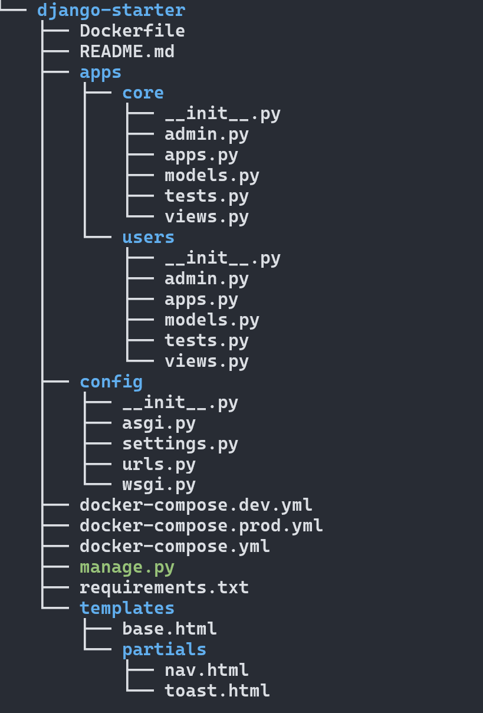

# django-starter
Django-starter is a reusable Django starter template, set up using `uv` for modern Python environment and dependency management. This template includes best practices for project structure, app organization, and environment setup.

### Project Structure
<div align="center">
    
</div>

### Preriquisite
Make sure you have the following installed on your local development machine:
Python 3.10+
`uv or pip` (Python environment manager)

### Set Up
1. Clone the repository
   `https://github.com/nicholas-karimi/django-starter.git`
2. Create and initializa a virtual environment
   Ensure` pip` and [uv](https://docs.astral.sh/uv/getting-started/installation/#configuring-installation) are installed
    - using `pip` `python3 -m venv venv` - 
    -  activate `source venv/bin/activate`
    
    Using `uv` 
    `uv venv venv`
    `uv pip install -r requirements.txt`
    activate `source venv/bin/activate`

3. Configure environment variables
   Copy the `.env.example` to `.env` in your project root and define env specif variables
   > Generate secret Key
    ```python
        python manage.py shell
        from django.core.management.utils import get_random_secret_key
        print(get_random_secret_key())
        exit()
    ```
4. Build and run the Docker container
   `docker compose -f docker-compose.yml -f docker-compose.dev.yml up --build`
5. Run migrations
   `docker compose exec container_name python manage.py migrate`
6. Create a superuser
    `docker compose exec container_name python manage.py createsuperuser`
7. Access the application
   `localhost:port`
8. Create New Apps
   `docker compose exec container_name python manage.py startapp yourappname apps/yourappname`